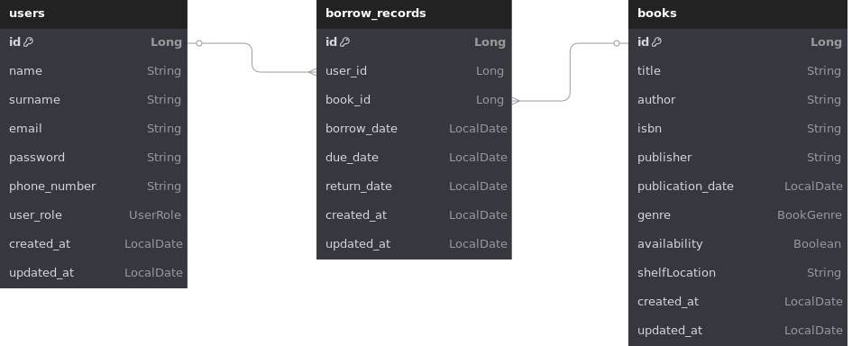

# 📚 Getir Java Spring Bootcamp Final Case – Library Management System

This project was developed as a capstone project for the **Patika.dev & Getir Java Spring Boot Bootcamp**. The aim is to build a **Library Management System** using Spring Boot that manages books, users, and borrowing operations efficiently.


## ✨ Features

* Secure authentication with JWT
* Role-based authorization system
* Register, update, delete users and manage roles
* Add, delete, update, and search books
* Borrow and return books
* Automatic tracking of overdue books
* Detailed API documentation with Swagger
* Unit and integration tests using JUnit and H2 database
* Clean architecture following SOLID principles
* Run the application in a container using Docker and Docker Compose
* Real-time book availability updates with WebFlux
* Centralized logging using AOP (Aspect-Oriented Programming)

## 🛠️ Technology Stack

* Java 21
* Maven
* Spring Boot 3+
* PostgreSQL
* Spring Security (JWT)
* Spring Data JPA (Hibernate)
* Swagger / OpenAPI
* JUnit & H2 for testing
* Docker, Docker-Compose
* Spring WebFlux


## 🚀 Getting Started

### ⚙️ Setup

To run the project on your local machine, follow the steps below:

1. Clone the repository:

```bash
git clone https://github.com/ilknurdgn/getir-final-case.git
cd getir-final-case
```

2. Open your PostgreSQL client (e.g., terminal or pgAdmin) and run the following command to create a new database:

```sql
CREATE DATABASE your_db_name;
```

3. Open the `src/main/resources/application.yml` file and fill in your database credentials as shown below:

```yaml
spring:
  datasource:
    url: jdbc:postgresql://localhost:5432/your_db_name
    username: your_db_username
    password: your_db_password
```

4. Run the application:

```bash
./mvnw spring-boot:run
```

---

### 🐳 Docker Setup

You can run the entire application using Docker and Docker Compose.

1. Open your terminal and navigate to the root directory of the project:

```bash
cd getir-final-case
```

2. Start the application and its dependencies:

```bash
docker-compose up --build
```

3. Once everything is up, visit:

```
http://localhost:8080
```

4. To stop the containers:

```bash
docker-compose down
```


## 📘 API Documentation

Access Swagger UI to explore and test the API:

```
http://localhost:8080/swagger-ui/index.html
```


## 🗂️ Database Schema

<div align="center">
  
</div>


## 📮 Postman Collection

Explore and test API endpoints with the official Postman collection:

[**Open Postman Collection**](https://www.postman.com/aerospace-astronomer-35504448/workspace/getir-final-case/collection/33682143-1291453f-ac80-4658-8d72-5439710da5b8?action=share&creator=33682143)


## 🔐 Authentication

Handles user registration and login operations. Upon successful login, a JWT token is returned and must be included in future requests for authentication.

| Method | Endpoint                | Description     |
| ------ | ----------------------- | --------------- |
| POST   | `/api/v1/auth/register` | Register a user |
| POST   | `/api/v1/auth/login`    | Login           |


## 🧑‍💼 User Endpoints

Allows authenticated users to manage their own profile information. Includes viewing, updating, and deleting their own account data.

| Method | Endpoint                | Description                       |
| ------ | ----------------------- | --------------------------------- |
| GET    | `/api/v1/users/profile` | Get authenticated user profile    |
| PATCH  | `/api/v1/users/profile` | Update authenticated user profile |
| DELETE | `/api/v1/users/profile` | Delete authenticated user profile |


## 🗃️ Admin User Management

Provides administrative access to manage other users in the system. Typically used by users with elevated roles (e.g., LIBRARIAN) to perform CRUD operations on any user.

| Method | Endpoint             | Description       |
| ------ | -------------------- | ----------------- |
| GET    | `/api/v1/users`      | Get all users     |
| GET    | `/api/v1/users/{id}` | Get user by ID    |
| PATCH  | `/api/v1/users/{id}` | Update user by ID |
| DELETE | `/api/v1/users/{id}` | Delete user by ID |


## 📚 Book Management

Enables CRUD operations on books within the library system. Also includes a search endpoint to filter books by title, author, genre, or ISBN.

| Method | Endpoint               | Description            |
| ------ | ---------------------- | ---------------------- |
| POST   | `/api/v1/books`        | Add a new book         |
| GET    | `/api/v1/books`        | Get all books          |
| GET    | `/api/v1/books/{id}`   | Get book details by ID |
| GET    | `/api/v1/books/search` | Search books           |
| PATCH  | `/api/v1/books/{id}`   | Update a book          |
| DELETE | `/api/v1/books/{id}`   | Delete a book          |


## 📅 Borrow Record Management

Manages borrowing activities. Users can borrow and return books, view their own borrowing history, and administrators can access overdue or all borrowing records.

| Method | Endpoint                         | Description                             |
| ------ | -------------------------------- | --------------------------------------- |
| POST   | `/api/v1/borrow-records`         | Borrow a book                           |
| GET    | `/api/v1/borrow-records`         | Get all borrow records                  |
| GET    | `/api/v1/borrow-records/profile` | Get authenticated user's borrow history |
| GET    | `/api/v1/borrow-records/overdue` | Get overdue records                     |
| GET    | `/api/v1/borrow-records/return/` | Return a borrowed book                  |

## 📡 Real-Time Availability
This endpoint provides real-time updates on book availability using Spring WebFlux. It’s designed to support reactive data flow between server and client (e.g., SSE or WebSocket-based systems).

| Method | Endpoint                     | Description                        |
| ------ |------------------------------| ---------------------------------- |
| GET    | `/api/v1/books/availability` | Stream real-time book availability |

---
- **LinkedIn:** [ilknurdogan](https://www.linkedin.com/in/ilknurdogan/)
- **GitHub:** [ilknurdgn](https://github.com/ilknurdgn)
- **Email:** [ilknurddogan265@gmail.com](mailto:ilknurddogan265@gmail.com)
- **Website:** [www.ilknurdogan.dev](https://ilknurdogan.dev/)